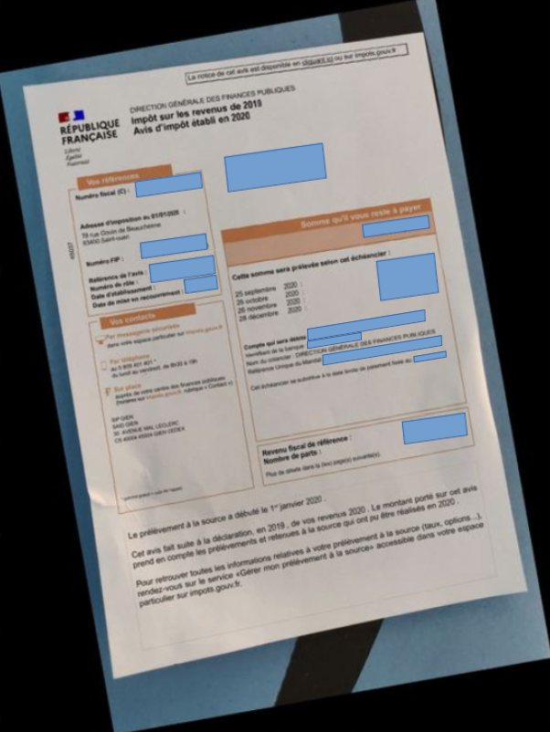
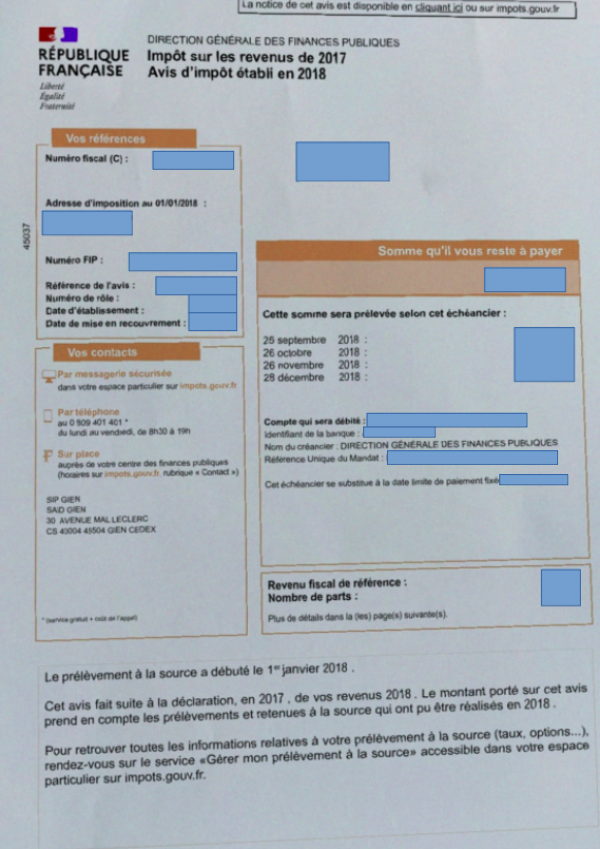

# Crop-and-OCR-documents-and-deployment-using-FastAPI-and-DOCKER-

Data scientist | [Anass MAJJI](https://www.linkedin.com/in/anass-majji-729773157/)
***

## :monocle_face: Description
This project aims to implement two algorithms to crop and extract text fields from any document, and deploy in a web app using FastAPI and DOCKER.

- The first technique is a SIFT model (scale-invariant feature transform), a model used to identify similar elements between different images.

- The second is a model based on Kmeans for clusturing to segment the image into many blocs/objects, then we detect the countour's document and rotate it based on its letter orientation. 

  

 

## :rocket: Repository Structure
The repository contains the following files & directories:
- **docker directory:** : The folder contains the webapp files as well as the dockerfile and requirements.txt needed to deploy with Docker. The web application was developed using FastAPI for the Back-End, and HTML/CSS/Javascript code for the Front-End.

- **crop_ocr_documents.ipynb :** Is the script where we detail the two techniques for cropping and extracting text fields from documents

- **images directory:** The folder contains the images used on the notebook.

## :chart_with_upwards_trend: Performance & results

we tested the model on 300 tax notices. The SIFT method does not crop all documents, especially when the scans are not of a good quality, while the second script which is based on the kmeans algorithm crops and extracts the text fields from any document. 

  
   

---
## :mailbox_closed: Contact
For any information, feedback or questions, please [contact me][anass-email]

[anass-email]: mailto:anassmajji34@gmail.com
