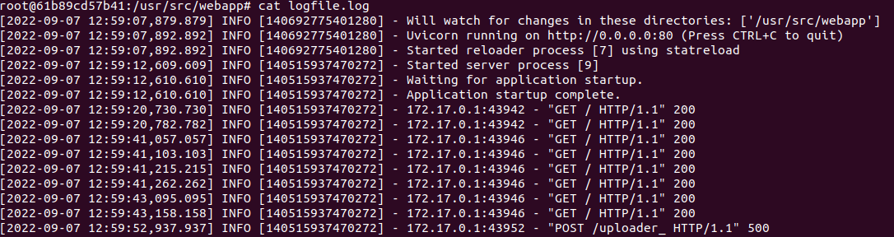

# Crop-and-OCR-documents-and-deployment-using-FastAPI-and-DOCKER-

Data scientist | [Anass MAJJI](https://www.linkedin.com/in/anass-majji-729773157/)
***

## :monocle_face: Description
This project aims to implement two algorithms to crop and extract text fields from any document, and deploy in a web app using FastAPI and DOCKER.

- The first technique is a SIFT model (scale-invariant feature transform), a model used to identify similar elements between different images.

- The second is a model based on Kmeans for clusturing to segment the image into many blocs/objects, and the openCV packages to detect the countour's document and rotate it based on its letter orientation. 

  

 

## :rocket: Repository Structure
The repository contains the following files & directories:
- **docker directory:** : The folder contains the webapp files as well as the dockerfile and requirements.txt needed to deploy with Docker. The web application was developed using FastAPI for the Back-End, and HTML/CSS/Javascript code for the Front-End.

- **crop_ocr_documents.ipynb :** Is the script where we detail the two techniques for cropping and extracting text fields from documents

- **images directory:** The folder contains the images used on the notebook.

## :collision: Demonstration 

To launch the deployment of the webapp with docker, type the following commands : 

 - docker build -t webapp_ocr .   : to build the docker image

 - docker run -p 8000:80 webapp_ocr:latest  : to launch the container based on our image

 If we visit http://127.0.0.1:8000/, we'll get our webapp deployed.

Below the demonstration:

In order to track the webapp's logs in the docker container, type the following command to explore the container state: 

sudo docker exec -t -i ID_CONTAINER /bin/bash

Then logs are stored in the logfile.log as shown bellow : 

  

## :chart_with_upwards_trend: Performance & results

we tested the model on 300 tax notices. The SIFT method does not crop all documents, especially when the scans are not in a good quality, while the second script which is based on the kmeans algorithm crops and extracts the text fields from any document. 

  
     
   

After cropping the document, we use Pytesseract to recognize and read the text embedded in the scan, means: we convert a scan document which is an image to text file. We use then Regex to extract text fields from the document.

  
   
   
   
   

---
## :mailbox_closed: Contact
For any information, feedback or questions, please [contact me][anass-email]

[anass-email]: mailto:anassmajji34@gmail.com
